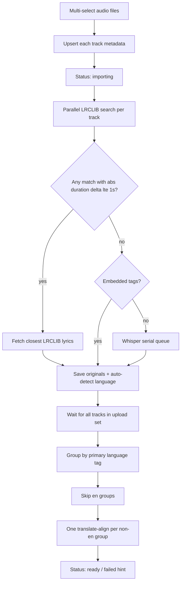
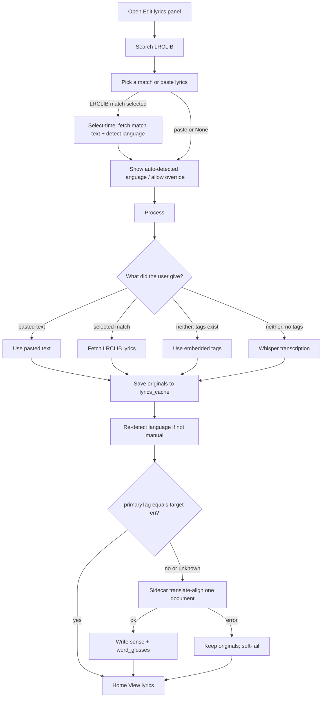
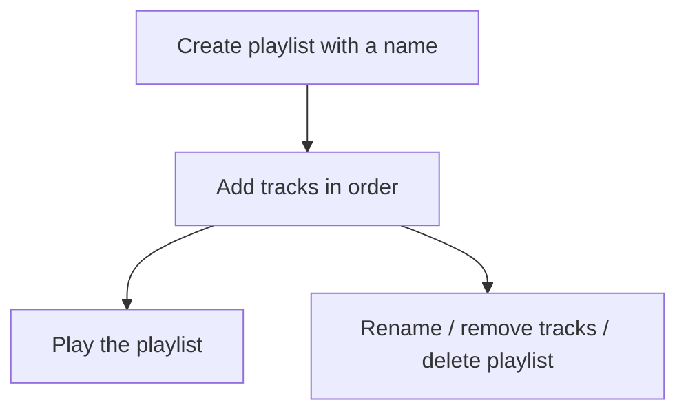

# Current pipeline

What Melodica does today, from file to lyrics on screen (upload auto-pipeline, Edit Process, select-time language detect, and translation).

## Upload auto-pipeline

Every upload (one file or many) upserts tracks then runs lyrics + translation in the background.

Duration compare: track `duration_ms` vs LRCLIB `durationSeconds`. Missing either side → no LRCLIB auto-pick. Ties: closest delta, then LRCLIB API order. Soft-fail per track; batch-translate whoever acquired successfully. Unknown language still attempts translation with `sourceLanguage: null`.

## Edit Process (manual)

Process order: **paste > LRCLIB match > embedded tags > Whisper**.

Edit LRCLIB auto-select uses the same **±1s duration match** as upload (`preferredMatchId` on search results). Select-time detect runs on LRCLIB match select only (not paste). It does **not** write lyrics. Song language override is preference-only until Process.

## Line-aligned translation

After originals are stored and language is resolved:

- **Skip** when the primary language tag equals the target (`en` for now).
- **Upload set:** one `POST /translate-align` per language group with **multiple documents**.
- **Edit Process:** one document containing all lines for that track.
- Each line stores:
  - `translated_text` — full sentence sense in the target language
  - `word_glosses` — JSON `[{text, gloss}, …]` under the original tokens
- Home **View lyrics** shows tokens with glosses underneath and the sentence sense in a separated column to the right.
- Translation failures **soft-fail**: originals remain; Home shows a muted hint to try again / check the API key.

API key precedence: **Settings-stored key overrides `MELODICA_TRANSLATE_API_KEY`**.

# Future flow

## Playlists

Tables `playlists` and `playlist_tracks` already exist. No UI yet.

## Play history

Table `play_history` already exists (`track_id`, `played_at`). When the user starts a track, append a history row. A recently-played list can read that table later.
