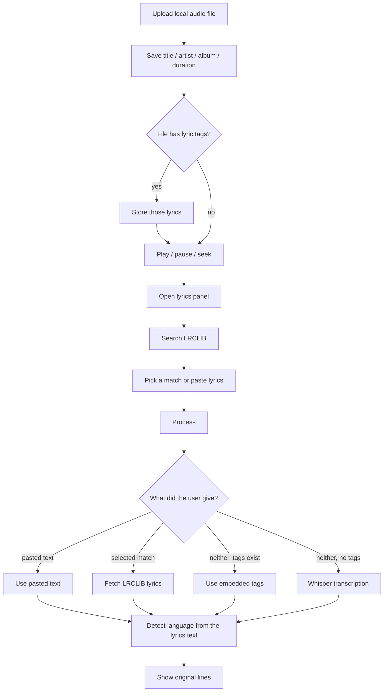
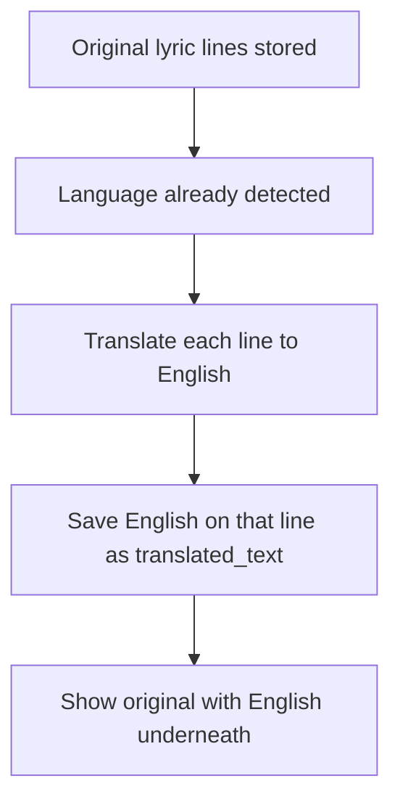
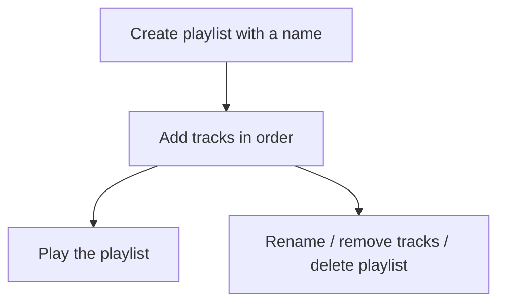

# Current pipeline

What Melodica does today, from file to lyrics on screen.

Process order: **paste > LRCLIB match > embedded tags > Whisper**.

# Future flow

Not built yet. Continues after original lyrics are stored.

## Line-aligned translation

Each original line (e.g. Japanese in `original_text`) is translated to English and saved on the **same** `lyrics_cache` row as `translated_text`. Mapping is `line_index`. Target is English for now; other languages later, still one `translated_text` per line.

## Playlists

Tables `playlists` and `playlist_tracks` already exist. No UI yet.

## Play history

Table `play_history` already exists (`track_id`, `played_at`). When the user starts a track, append a history row. A recently-played list can read that table later.
