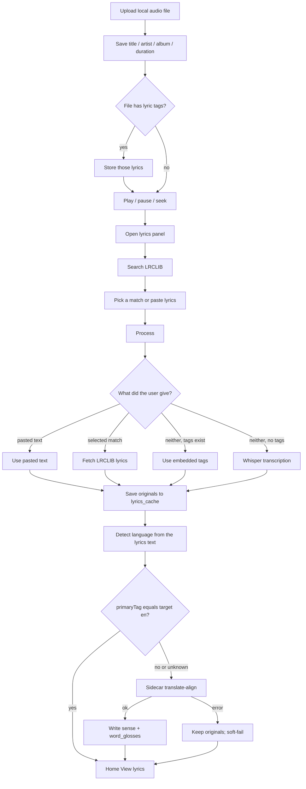
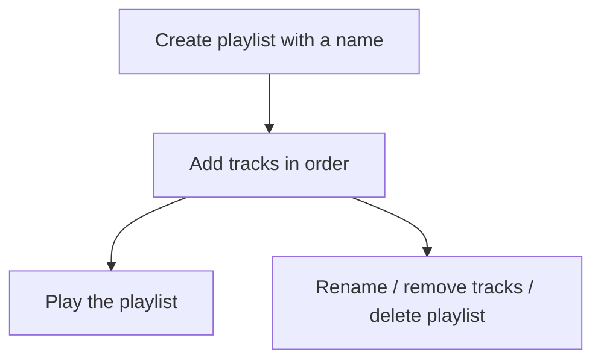

# Current pipeline

What Melodica does today, from file to lyrics on screen (including translation after Process).

Process order: **paste > LRCLIB match > embedded tags > Whisper**.

## Line-aligned translation (as of Process)

After originals are stored and language is detected:

- **Skip** when the primary language tag equals the target (`en` for now).
- Otherwise call the sidecar `POST /translate-align` with **one lyrics document containing all lines** (the API accepts **multiple same-language documents** for future multi-song upload batching).
- Each line stores:
  - `translated_text` — full sentence sense in the target language
  - `word_glosses` — JSON `[{text, gloss}, …]` under the original tokens
- Home **View lyrics** shows tokens with glosses underneath and the sentence sense in a separated column to the right.
- Translation failures **soft-fail**: Process still succeeds with originals; Home shows a muted hint to try again / check the API key.

API key precedence: **Settings-stored key overrides `MELODICA_TRANSLATE_API_KEY`**.

# Future flow

## Playlists

Tables `playlists` and `playlist_tracks` already exist. No UI yet.

## Play history

Table `play_history` already exists (`track_id`, `played_at`). When the user starts a track, append a history row. A recently-played list can read that table later.

## Multi-song translate batching

`POST /translate-align` already accepts multiple `documents` of the same source language. When upload can process many songs at once, Rust should group tracks by language and pass several documents per call to save provider round-trips.
