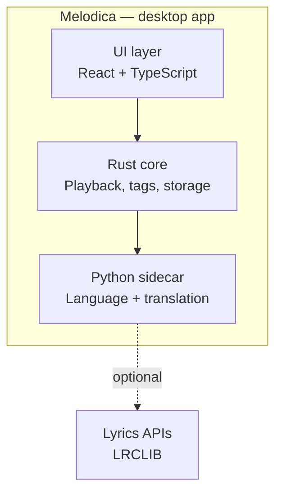
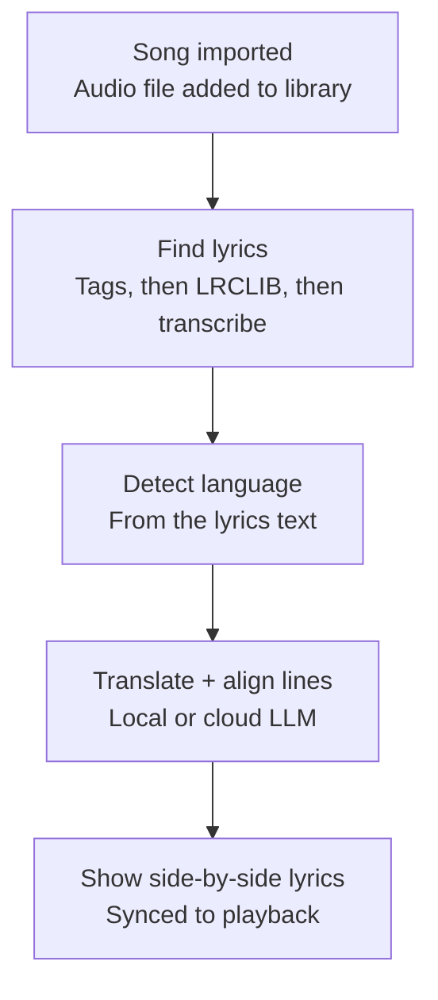

# Melodica — architecture & tech stack plan

**What it is:** a downloadable desktop music player that automatically surfaces lyrics for any song, in the song's original language, with a line-aligned translation directly underneath — built to help you learn a language while listening to music you already like.

Melodica's hard part isn't the player — it's the pipeline that turns a raw audio file into synced, line-aligned lyrics in two languages. This plan covers the architecture, the tech stack, the core pipeline, storage, and a suggested build order.

---

## Architecture overview

Everything runs locally on the user's machine. The app is a thin UI shell over a native core that handles playback and files, plus a small local service that handles the "understanding language" work — detection, lyrics lookup, and translation. Only that last piece ever needs the internet, and only optionally.



- **UI layer (React + TypeScript, inside a Tauri webview):** player controls, side panel (lyrics / playlists / recommendations), library view.
- **Rust core (Tauri backend):** audio decode/playback, tag reading, SQLite access, and the IPC bridge to the UI.
- **Python sidecar (FastAPI, bound to localhost only):** language detection, lyrics fetching, translation + line alignment, and the speech-to-text fallback. This is the one piece that talks to the outside world, and only when it needs to.

---

## Tech stack

| Layer                    | Technology                                                 | Why                                                                                                                         |
| ------------------------ | ---------------------------------------------------------- | --------------------------------------------------------------------------------------------------------------------------- |
| UI shell                 | Tauri (Rust) + React + TypeScript                          | Small install size, native feel, reuses the React/TS frontend you built for FGC-Flow                                        |
| Playback                 | `symphonia` (decode) + `rodio` (output)                    | Pure-Rust, covers MP3/FLAC/WAV/OGG/AAC without external codecs                                                              |
| Tags & embedded lyrics   | `lofty-rs`                                                 | Reads ID3v2/Vorbis/MP4 tags, including embedded lyrics frames, across formats                                               |
| Language engine          | Python sidecar on FastAPI                                  | Same framework you use at RBC Amplify; Python has the deeper NLP/ASR ecosystem                                              |
| Language ID              | fastText `lid.176`                                         | Fast, offline, 176-language text classifier — runs on the lyrics text, not audio                                            |
| Translation + line-align | Ollama locally, or a cloud LLM/DeepL, behind one interface | Reuses the local-LLM setup from RAGVault; swappable for quality later                                                       |
| Fallback transcription   | `faster-whisper`                                           | Transcribes vocals when no lyrics exist anywhere, and detects language for free                                             |
| Storage                  | SQLite via `rusqlite`/`sqlx`                               | Embedded, zero-config, plenty for a single-user local library                                                               |
| Packaging                | Tauri bundler                                              | Ships as `.msi`/`.dmg`/`.AppImage`; can bundle the Python sidecar as a compiled binary so users never need Python installed |

**Alternatives worth knowing about:**

- **Electron + Node.js** — faster to build if you'd rather stay in one language end to end (Node instead of Rust, `child_process` instead of Tauri's sidecar mechanism), at the cost of a much larger install (Electron bundles Chromium; expect 150MB+ versus Tauri's 10–20MB).
- **JUCE (C++)** — what actual DAWs are built on, worth it only if you want deep control over audio internals like real-time EQ or custom DSP. Heavier lift than a playback-plus-lyrics app needs.

---

## The core pipeline

This is the signature feature, and it runs once per song, caching its output so replays are instant.



**Language detection happens on the lyrics _text_, not the raw audio.** Identifying sung language directly from a waveform is a much noisier problem — vocals sit under instrumentation, pitch varies, melisma stretches syllables. Once you're already fetching or transcribing lyrics anyway, running a text classifier on that string is both simpler and far more reliable.

**On lyrics sources — what each one actually gives you:**

- **LRCLIB** — free, open, no API key, covers both plain and time-synced lyrics. Built specifically for this use case. The public instance is rate-limited to roughly one request every 30 seconds, so cache aggressively or consider self-hosting for a large library. This is the natural first stop.
- **Musixmatch** — the free developer tier only returns short lyric previews rather than full text; full and synced lyrics require a paid commercial license.
- **Genius** — good for search and metadata, but its API doesn't expose a lyrics endpoint at all.

Given that, lean on LRCLIB with Whisper transcription as the honest fallback for anything it doesn't have, rather than leaning on Musixmatch's preview text or scraping Genius pages.

**Translation + line alignment:** prompt the LLM for structured output — per document, a JSON array of lines with `{lineIndex, sense, words:[{text,gloss}]}` — rather than a free-flowing translated paragraph. The endpoint accepts **multiple lyrics documents** of the same language so future multi-song upload can batch provider calls. Word glosses sit under original tokens; `sense` is the full-line meaning.

---

## Local storage

A handful of SQLite tables cover it:

```
tracks(id, file_path, title, artist, album, duration_ms, language_code, added_at)
lyrics_cache(id, track_id, line_index, timestamp_ms, original_text, translated_text, word_glosses, source)
playlists(id, name, created_at)
playlist_tracks(playlist_id, track_id, position)
play_history(id, track_id, played_at)
```

`source` on `lyrics_cache` (`embedded` / `lrclib` / `asr`) is worth keeping — it makes it easy to debug mismatches and decide when a track is worth re-fetching.

---

## Suggested build order

1. **Playback shell** — Tauri window, import a folder, play/pause/seek/volume, read basic tags. No lyrics yet; just get the player working.
2. **The core pipeline** — wire up the Python sidecar, LRCLIB lookup, language ID, and LLM translation with line alignment. This is where the project's actual value shows up.
3. **Sync + polish** — parse LRC timestamps for karaoke-style highlighting, build out playlists, clean up the side panel.
4. **Fallback + recommendations** — Whisper transcription for songs with no lyrics anywhere, and a first-pass recommendation engine (start with same-artist/genre and recently-played, then grow into audio-feature similarity via `librosa`, or even language-learning-aware suggestions like surfacing more songs in a language you're partway through).

---

## A few practical notes

- **Lean on LRCLIB, treat the others as backups.** It's free, keyless, and built for exactly this use case; Musixmatch and Genius both come with real access restrictions on full lyrics.
- **Make the translation backend swappable.** A thin `TranslationProvider` interface behind Ollama, DeepL, and a cloud LLM lets you default to fully offline and let people opt into paid quality later, without touching the rest of the pipeline.
- **Vocal isolation helps ASR accuracy.** If you build out the Whisper fallback, running the track through a source-separation model like Demucs first (stripping instrumentation) noticeably improves transcription quality on sung vocals, which are harder for ASR than plain speech.
- **Cross-platform is close to free.** Both Tauri and Electron produce Windows/macOS/Linux builds from one codebase, so there's no need to pick a platform up front.
